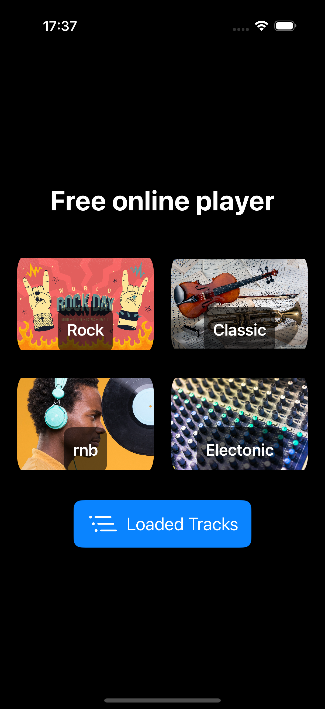
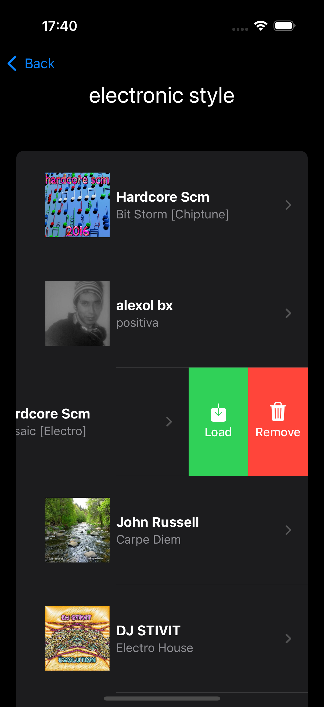
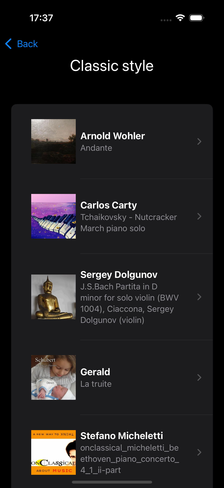
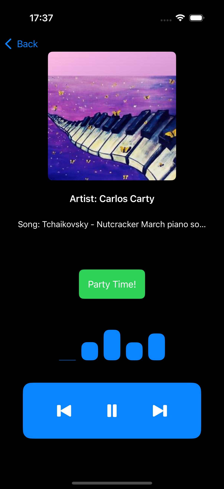

🎵 iOS Music Player (Beta)
This project is a beta version of an online music player for iOS, powered by the Jamendo music platform. The player provides access to specific music genres and includes additional features to enhance the listening experience.

📋 Key Features:
Jamendo API Integration

Automatically fetches tracks from the following genres:
Rock
Classical
R&B
Electronic
Online Music Playback

Stream tracks seamlessly in real-time.
Offline Mode

Download tracks to your device for offline listening.
Playback Effects

Built-in flashlight blinking synchronized with the music for a unique atmosphere.
🚀 Technologies:
iOS Development (Swift)
Jamendo API Integration
Local Storage (for offline functionality)
🛠️ Future Plans:
Expand the list of supported genres.
Add customization options for the user interface and flashlight effects.
Support playlist playback.

Welcome to the project! Feel free to share your ideas and suggestions. 😊

## Screenshots

### Main Screen

### Songs

### Player

